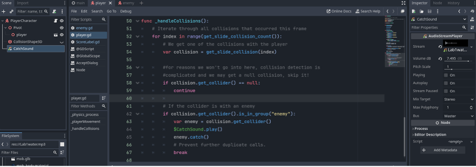
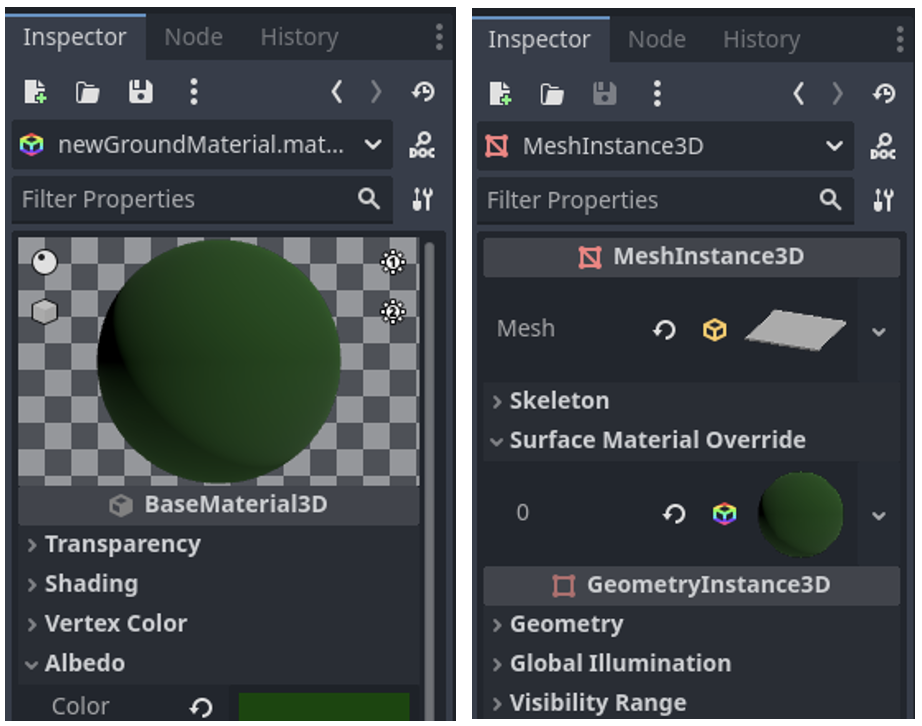
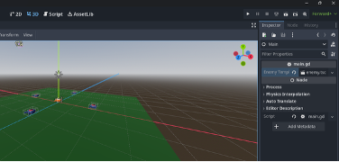

# Lab 1: Update the Creeps (Creeps pt. 2)

### Due Monday (January 19th) at 11:59pm

#### Goal: Make what was created in Lab 0 an actual game.
---
#### Introduction
This is our first graded lab, so as it progresses we’ll start giving a little less guidance in this tutorial text. *Refer to the prior lab if you need to, this lab assumes you have an understanding of Lab 0.*: [click here to see the Lab 0 instructions](https://github.com/CS-2053-2026/Labs/blob/main/Lab-0/lab-0.md). However, it would also be a good idea to do Lab 0 completely, by starting it from the link on D2L.

This might seem long, but much of the early steps are quite quick and simple.

This lab, we will explore a few more fundamentals you should know, like how to add sounds to a game in Godot, how to do some of the things we did last lab in the Editor, but this time in code. 

For this lab, you should *really* first finish Lab 0. It's necessary to master these basics before moving on. If you had problems, this is a good time to fix them up and learn more about things you struggled with.

---

## Collisions
You can notice if you bump into a mob *(and by the fact that you aren't falling through the floor)* that basic collisions are already working.
This is all thanks to our `CollisionShape` nodes.
But to make more *complex* collisions we can get more creative.

Godot physics works on a system of **masks** and **layers**.
Simply, every object that can interact with other objects physically must belong to a **layer**, and that **layer** can only interact with objects on **layers** specified in its **mask**.
*For example*, you may have shiny coins to pickup for an adorable plumber character, and perhaps enemies to jump on.
You could make a **layer** for the player, one for the pickups, and one for the enemies.

You could set the player mask to interact with both the pickup layer and the enemy layer, but perhaps you would not allow the enemies to interact with pickups, so you would not include the pickup layer in the enemy mask, or vice versa.

For this simple lab, we will have **three layers**: one for the enemies, one for the world environment, and one for the player. 

>  - Open project settings, and scroll down on the left menu in the **General** tab to find **Layer Names**. 
> - Select **3D physics**, and name Layer 1 to be `player` and layer 2 to be `enemies`, and layer 3 to be `world`
> - Return to the player scene and select the player top level **node**. 
> - In the inspector note you can see all the subnode properties as well. 
> - In the `CollisionObject3D` menu, expand \"Collision\" and you will see by default this node is on *layer* 1 and its *mask* contains only 1.
> - Layer 1 is supposed to be for the player, so let\'s leave it on that layer.
> - For the *mask*, we should ask \"what objects can the player interact with?\"
> - In this lab, it will be **everything**! So let\'s make sure layers 1, 2, and 3 are selected in the mask.

Let\'s do the **enemy** and **main** scenes next.
> - It should be on layer 2, and the Ground in the main scene should be on layer 3, but what should they interact with? 
> - For now, let\'s make their masks also 1, 2, and 3. -- *we reconsider this later*

Now, all our objects can interact with each other.
*Nothing looks or acts differently yet, so there is a little more that we need to do*

So, how do collisions work?
Well, first, we look up what an object collided with every frame.
But how do we tell if we collided with the **floor** or by hitting the **enemy**?

## Groups

Groups are a powerful way to tag different types of nodes so that they are easy to look up in a variety of situations. 

> - Go to the **enemy** scene, and in the inspector tab, note there is another tab beside it called \"Node\". 
> - Go to it, and select \"Groups\" right under it.
>  - Create a group \"enemies\". 
> - Make sure you are on the enemy scene when you do this as it adds the current scene to the group.

Now, we can see if the player has collided with this group.
Return to the main scene and re-open your **player script**.

We\'re going to add more to our `_physics_process` function.
It\'s getting a little large, so let\'s put this new code in its own function, which we'll call `_handleCollisions()`. 
**Don\'t forget to call this new function from your `_physics_process` function!**

Your collision handler should look something like this:

```gdscript
func handleCollisions():
	# Iterate through all collisions that occurred this frame
	for  index in range(get_slide_collision_count()):
		# We get one of the collisions with the player
		var collision = get_slide_collision(index)
		#for reasons we won't go into here, collision detection is
		#complicated and we may get a null collision, skip it!
		if collision.get_collider() == null:
			continue
		# If the collider is with an enemy
		if collision.get_collider().is_in_group("enemies"):
			var enemy = collision.get_collider()
			enemy.catch()

    # Prevent further duplicate calls.
```
The comments in the code should help explain what is happening.

Note how we can check if an *object* we collided with is in a *group*.
Any Node can be in a group, so this is quite useful to sort through your nodes, and you can make many groups if it helps you.
> **Note** we also asked to call a catch() function we haven\'t defined yet.
*Let\'s add it to our enemy script.*

Add this at the top of your script to define a *Signal*:

```gdscript
signal caught
 # ...

# Emitted when the player jumped on the mob. signal caught
func catch():
    #sends the signal that an enemy has been caught
    caught.emit() 
    #delete this node later this frame
    queue_free() 
```
This emits the `caught` signal, so we can take actions elsewhere because of this.
(then `queue_free()` cleans up the enemy node)

You should be able to intersect with the enemies and `catch` them.
> Make sure your `player` and `enemy` collision spheres are large enough to touch.

## Scoring (UI) 

Now we have added *capturable* **enemies**!

Time to keep track of the `caught` score in a variable and display it on screen using a minimal interface.
We'll just use a **text label** to do that for now.

In the main scene, add a new child node `Control <class_Control>` to `Main` and name it `UserInterface`.
> Switch to the **2D** screen, where you can edit your *non-diegetic* UI.

Add a `Label <class_Label>` child node and name it `ScoreLabel`


In the *Inspector*, set the *Label*\'s *Text* to a placeholder like \"Score: 0\".


Also, the text is white by default, like our game\'s background. We need to change its color to see it at runtime.

Scroll down to *Theme Overrides*, and expand *Colors* and enable *Font Color* in order to tint the text to black (which contrasts well with the white 3D scene).


Finally, click and drag on the text in the viewport to move it away from the top-left corner.


## Modifying the UI theme

Once again, select the `UserInterface` node. In the *Inspector*, create
a new theme resource in *Theme -\> Theme*.


Click on it to open the theme editor In the bottom panel. It gives you a preview of how all the built-in UI widgets will look with your theme resource.


By default, a theme only has a few properties: *Default Base Scale*, *Default Font* and *Default Font Size*.


The *Default Font* expects a font file like the ones you have on your computer. 
In the *FileSystem* dock, expand the `fonts` directory and click and drag the `Montserrat-Medium.ttf` file we included in the project onto the *Default Font*.
The text will reappear in the theme preview.

The text is a bit small. Set the *Default Font Size* to `22` pixels to increase the text\'s size.


## Keeping track of the score

Let\'s work on the score next.
Attach a new script to the `ScoreLabel` and define the `score` variable.

```gdscript
extends Label

var score = 0
```

Okay, now that we have your score text, we need it to change as we catch the creeps.
*(Remember those `signals` from before?)*

> - Click on one of your enemies.
> In the inspector, switch to the Node tab and underneath it, select Signals. 
> - These are all the signals the node you selected can emit.
> You should be able to see \"Caught\", which we made earlier during the collision section.
> - Double click caught() and it will prompt you in a new window to create a function.
>  You\'ll see your scene tree - find ScoreLabel and select it with "connect"


This will take you back to your ScoreLabel.gd with a new function.
Now, every time the "**caught**" signal is emitted this function will be called. 

Do this for all 4 enemies.

**However**, note that when you try to connect the signal to a function for enemy2-4, it tries to create a new function like ```_on_enemy2_caught()```. 

That's no good -- we want the same function to be called for all of them. 

While ScoreLabel is selected in the Connect dialogue, pick \"Pick\" and select the ```_on_enemy_caught()``` function you already made.

Repeat this for all 4 enemies, selecting ```_on_enemy_caught()``` each time. You *may* need to leave the script view each time for this dialogue to pop up -- just swap to the 3D view from the toolbar at the top of the window.

We\'ll find out how to do this programmatically later.

Now all 4 enemies should be connected to the `_on_enemy_caught` function.
To check this, look at the function code in ScoreLabel\.gd. You should now see a small green link symbol by the function. By double-clicking it you can see all signals linked to this function.


There!
Now let\'s update the score and text when a creep is caught.

Change the function:
`gdscript _on_enemy_caught():`

```gdscript
    func _on_enemy_caught():
        score += 1
        text = "Score: %s" % score
```
Test your code.
**Your score should now update as you catch creeps!**

## Ending and restarting the game

If you want to restart the game, currently you have to close and reopen.

Let's add a popup window when the player finishes and a restart button.

Right-click your root UI node and add a child, \"**Accept Dialog**\" and name it \"**WinScreen**\".

In the inspector, change the OK Button Text to \"**Restart**\" and add a congratulatory text like \"**Wow You Win!!!**\" in the \"*text*\" field. 

Finally, in the Window option pane, change \"*Initial Position*\" to a nice option like \"*Center of primary scene*\" or something that looks good to you.

Now, let\'s make it appear on win.
In the ScoreLabel script, add a new variable:

```@export var winScreen : AcceptDialog```

This tells Godot this variable should be a Godot Node of type AcceptDialog.

Drag the WinScreen node from the scene tree to this variable. This is assigning the Node to that variable at game setup.

In the **enemy_caught** function, we can now make it visible when we meet the max score.

```gdscript
@export var MAX_SCORE = 4

@export var winScreen : AcceptDialog

#...old code here
func _on_enemy_caught():
    score += 1
    text = "Score: %s" % score
    if score == MAX_SCORE:
    winScreen.visible = true
```

Now, click the WinScreen node in the scene tree and connect its confirmed() signal to a new function we\'ll make in the scoreLabel.gd script. That function will simply reset the main scene tree:

```gdscript
func _on_win_screen_confirmed():
    get_tree().reload_current_scene()
```
**Try it out!**


## Sound
Sound makes a game a lot more lively and engaging.

A big part of game design is sound design, which we won't be able to explore, but see below if you are interested in more: 
> There are entire research journals dedicated to the effects of sound on people’s emotions, thoughts, and perceptions!
If you want to learn more about getting into sound, here’s a good start:
https://www.gamedeveloper.com/audio/sound-design-for-video-games-a-primer

For connecting the basics of sound to our game, we’ll want to be able to make sounds play when certain events occur. For that, we’ll need some sound files. You'll notice `Lab1water.mp3` in the file system.

Godot uses **AudioStreamPlayer** nodes to play audio easily.
Add An **AudioStreamPlayer3D** node to your player in the Player scene *(not main scene)* and name it **“CatchSound”**. 
Click on the node and check the Inspector tab. There are a lot of options here! We’ll talk a bit more about sound later in the class.

For now, drag the `Lab1Water.mp3` from the FileSystem window (after you've imported it) to the **“Stream”** menu item in the inspector.
It should set that mp3 as the audio to be played. 
Change the “volume” *(currently at 0 decibels)* to something reasonable – mine was at 7db. 7db is actually quite low *(a whisper is around 30db)* but this gets processed at other stages. Just start low, and bring the volume up until its comfortable – *be careful as loud sounds can damage ears and sound equipment!*

In the **_handleCollisions()** function we made earlier, add **$CatchSound.play()** before the **enemy.catch()**:

```gdscript
# If the collider is with an enemy
		if collision.get_collider().is_in_group("enemy"):
			var enemy = collision.get_collider()
			$CatchSound.play()
			enemy.catch()
``` 

If you named your audio stream something other than “CatchSound” you should replace “`$CatchSound`” with “`$<yourStreamNameHere>`”. The “`$`” operator allows you to access a node by name. It’s useful for nodes you will know the name of beforehand.


 
Test your game.
**It should now play a sound when the collision happens!**

## Materials

Materials tell the engine the **colour**, **texture**, and other **visual properties** of an object, such as how it interacts with light (**reflectiveness**, **transparency**, etc). While we won’t go into a lot of details on this subject right now, most game editors allow you to set and change some basic material properties of 3D objects. Materials can also be created or imported from external resources.

#### Let’s create our own material.
In the FileSystem window, right click the Art subfolder and select **Create New** and select **Resource** from the pop out menu.Search for Material and select `StandardMaterial3D`, create it, and name it something like `newGroundMaterial` and to the right, select `Material` – then **save**.



Now click on the material and check the inspector tab. There are a lot of things we can play with here, much like sound! For now, click **Albedo**, and **Color**. Select a color you want the floor to be. We picked a nice Green, but it’s up to you.

The material is applied to the visible part of our object – the `MeshInstance3D` node of our Ground. Click on the MeshInstance. On the inspector tab, note in the `MeshInstance3D` properties the **Surface Material Override** property, and drag your material from the FileSystem to that property.

**The ground should now be that colour!**


## Spawning Creeps

In Lab 0 we manually created creeps in the inspector. However, it’s a bit boring to only have the 4 creeps in the game, and it/'s annoying to add them by hand. This lab, we will instantiate those child scenes ourselves in our program so we can spawn in new creeps dynamically!

First, as this will be something controlled by the environment, let’s attach a new script to the **Main** node of the **main** scene
Then, add in a variable:

```gdscript
@export var EnemyTemplate : PackedScene
```

The `:` operator after a variable allows you to tell Godot what **type** something is. This is useful for a number of reasons, including autocomplete in the script editor, and for assigning specific typed nodes in the visual editor. Save the script, and go to your main scene.

You should see the `EnemyTemplate` variable in the Inspector tab – locate your `enemy.tscn`, and drag it onto the `EnemyTemplate` property.



Let’s spawn the enemies in on a **timer**.
Add a new `Timer` type child node to Main called `SpawnTimer`.

In the Inspector, change the *Wait Time* to the desired **spawn rate** – I set mine to 5 seconds, but have fun! Then select `Autostart` to make sure the timer starts as soon as the game does. The timer will now emit a **Signal** at the rate you specified. Check the **Signals** in the Node tab, and note the `timeout()` event Signal now available. Double click it to create a function to handle this event, and let’s make it in the main script we created earlier. This will create `_on_spawn_timer_timeout()` in `main.gd`.

In this script, we’ll want to create a creep, and give it a position randomly on the ground.
First, let’s create a copy of an enemy:

```gdscript
var enemy = EnemyTemplate.instantiate()
```

Now, it’s not in the game yet – we have to add it to our Scene Tree, but before we do that, we should completely finish setting it up (or strange things can happen...).

Let’s give the creep a position. To do this, we’ll need to know how big the ground is, and to generate a random number. We can get the ground’s size from it’s `MeshInstance` properties.
We will then use `randf()`, which generates a random float between 0 - 1 inclusive, and use that with our ground size to set a position:

```gdscript
#set position of enemy to randomly on the ground
var groundSize = $Ground/MeshInstance3D.mesh.size
enemy.position.x = (randf() * groundSize.x) - groundSize.x/2
enemy.position.z = (randf() * groundSize.z) - groundSize.z/2
```

**Note the new notation here.**
We saw `$` to select a node by name.
We can select a sub node with the `/` operator.
So `$Ground/MeshInstance3D` looks for a Node called `Ground` in the Scene Tree, and then a subnode called `MeshInstance3D`. We then grab properties as you may expect. Note the properties are just the ones we can see in the Inspector tab (but lower case).
If you’re unsure what properties a Node has, consult the Godot doc online, or by right-clicking a Node or function and selecting “lookup symbol” for code or “open documentation” for nodes.

Then, we set the position.
*Any guesses how this works?*
Why do we subtract `groundSize/2`?
Think about it yourself or discuss it with a labmate.
If you can’t figure it out, ask the lab instructor or the Internet.

**Finally, add the Creep to the scene:**

```gdscript
add_child(enemy) #adds as a child of ourselves
```

**Try it out!**
It works mostly fine *but* there is still one issue.

Note that score doesn’t go up when we catch the programmatically spawned Creeps!

Take a moment and think about what we’ve done in the editor after instantiating our enemies earlier...

Link the Signal to the function `_on_enemy_caught` function!

We can do that programmatically by calling `connect()` on a Signal from a specific Node, and providing a function to run when that signal is called. 

So, for our enemy, we need to add:

```gdscript
enemy.caught.connect($UserInterface/ScoreLabel._on_enemy_caught)
```

**Now let’s try it!**
You may want to adjust your MAX_SCORE now that there are more creeps.

## Losing a Game
**For this one, we’ll be leaving it up to you to leverage what you have learned so far.**

Let’s make the game have actual challenge by having to **collect** a certain **number of creeps** within a **time limit**.
Display the timer counting down on screen.
When it hits `0`, display a **game over** and **restart** message.

**Good luck!**

>**Useful tip:** you can only `$node` your child nodes. 
If you want a non-child, use the whole path: ```$/root/Main/SpawnTimer.stop()```


#### For a final challenge
##### OPTIONAL
Try moving your creeps until they go off the cliff, then **delete** them!

Look to your player movement for inspiration on this.

---

## Submitting

Make sure you commit AND **PUSH** your game to github. Remember to go to the Github website and look at your repo to make sure the files are actually there!

The due date is **11:59pm - Monday, January 19th**.

and finally,
*Please* remember to fill out the \.md files
*(author, ai discloure)*

**Good Luck and Happy Coding!**