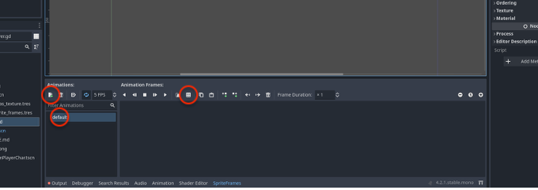
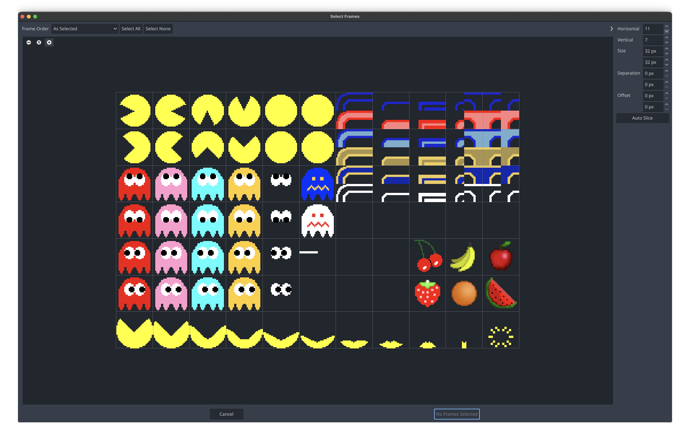
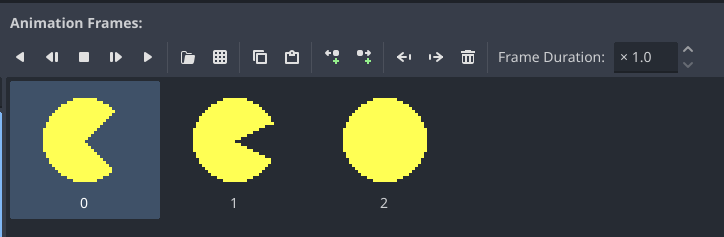
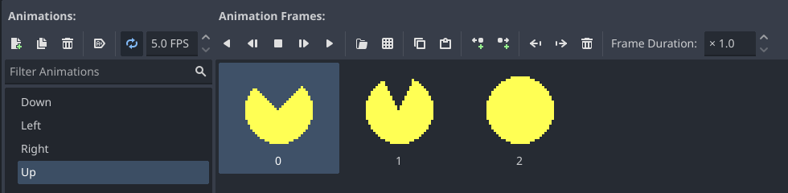
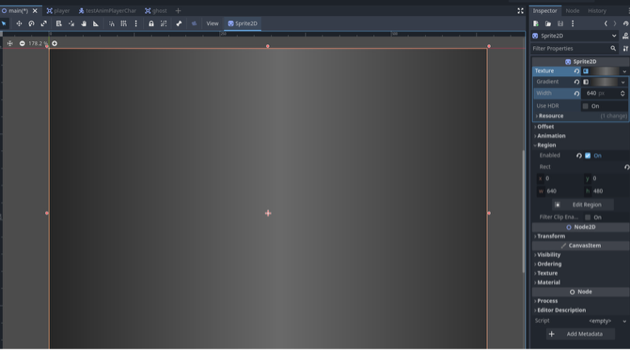

# Lab 2: Dodge the Ghosts

### Due Tuesday, January 26 @ 11:59 PM

#### Goal: Intro to 2D Godot Development

---

## Introduction

The purpose of the second (graded) lab is to introduce you to the basics of 2D Godot development, as well as review concepts we started in Lab 1 and explore their 2D counterparts.

We’re going to create a game using *Pac-Man–like* assets and have Pac-Man run away from ghosts for as long as possible.
Ghosts will continuously spawn in greater and greater numbers.
The score is determined by how long the player survives.
*(and no that's not really how actual pac-man works)*

You already know everything you need from Labs 0 and 1, but some of the 2D nodes and ways of working are different.

Following from last lab, intructions will continue to get less explicit as the lab progesses.
You'll start to see much less *go here - press this* type instructions as you build skills.

So, before you begin, grab `sprites.png` from the `labs` repo on GitHub.
*(like you did for the sound file last time)*

## Starting a 2D Project

We’ve started the project for you!
In that project, start by making your first node a `Node2D`, and name it `Main`.

> **Note:** You will immediately be moved to the 2D view we saw when adding UI elements in the last lab.
> You’ll see a blue outline (the viewport) and a large grey canvas.

First, let’s make the game **640 × 480**--Check the old lab 0 instructions if you need a reminder on how to do this.

## Player Scene and Animations

Remember that in Godot, we compose scenes out of **smaller scenes**.

Like our 3D game, let’s make the player scene.

1. Make a new scene.
2. Make the root node an `Area2D` named `Player`.

The root node of a subscene should generally represent whatever that object will be. In this case, the player is an area controlled by the user to interact with the game environment.

This `Area2D` should also have an animation—add a child node: `AnimatedSprite2D`.

## Slicing the Sprite Sheet

We’ll now have to slice up the spritesheet so we can make the animations.

> First, if you haven’t already, make sure `sprites.png` is in your project—either by dragging the file into the Godot FileSystem panel, or adding it to your project folder manually.

Click on `AnimatedSprite2D`. In the **Animation** section of the Inspector, you’ll see an empty dropdown for **Sprite Frames**. Click it and select **New SpriteFrames**, then click the SpriteFrames object (not the arrow). A new panel will open.



Currently there is just the default empty animation. Rename it to `Right`.

Later, when we want to add **new** animations, we can click the plus icon above.

In the Animation Frames menu, click the grid icon. It will prompt you to select a resource for slicing—pick your `sprites.png`.



**This is the slicing menu.**
Sprites can be packed into a sprite sheet with different sizes and shapes, but most are divided into a grid.

*Horizontal* \& *Vertical* refer to rows and columns.
*Size* is the size per sprite,
and *Offset* moves the grid around by that many pixels.

First, experiment with these values to align the grid with the Pac \& ghost sprites.

This is a *particularily* easy sprite sheet; all the images are evenly sized and spaced.
This makes it easy to extract all the sprites, but not all sheets are so kind.

> Notice the *Size* will automatically adjust as you change rows and columns.

Once your grid is lined up, select the frames for the `Right` animation:
**the first two frames in the second row, and the third frame in the first row.**
Then add them with the button below.



Duplicate this process for `Down`, `Left`, and `Up`, selecting the two unique frames and the shared full-circle frame so each animation has 3 frames.

*You may need to reorder frames by dragging them if they’re in the wrong order.*
You will then have 4 animations total:



## Movement + Animations

But how do we *move* with animations?

> Revisit Lab 0 to remember how to make a player move with keyboard input.
> Set up input keybinds, add a script to the player, and in `_process()` check for `is_action_pressed()`.

We want to alter the directional velocity corrosponding to button presses:

```gdscript
func _process(delta):
	var dir := Vector2.ZERO
	
	if Input.is_action_pressed("moveRight"):
		dir = Vector2.RIGHT
	if Input.is_action_pressed("moveLeft"):
		dir = Vector2.LEFT
	...

```
> **Note**: don't forget to define any variables needed.
> like *dir* above, but we also need speed (*see lab 0*)


We also want to display a different animation depending on movement!

With `AnimatedSprite2D` selected, check its properties in the Inspector.
You’ll see an entry called **Animation** with a dropdown containing all your animations.

We can change this in code, for example:

```gdscript
$AnimatedSprite2D.animation = "Left"
```

**Add this logic to the code.**
Consider where and how to add to the input checks

**Finally**, we need to play the animation if we are moving, and stop it if we are not.
*We also need to actually move the player.*

Add something like this after your input code:

```gdscript
	if dir != Vector2.ZERO:
		# uodate POSITION based on the intended DIRECTION and SPEED
		position += dir * speed * delta
		...
		$AnimatedSprite2D.play()
	else:
		$AnimatedSprite2D.pause()

```

You should now be able to **play** your Player scene.

## Collision Shape

You may notice `Area2D` has a warning about having no shape.

Add a `CollisionShape2D` as a child.
Make the shape a circle that surrounds Pac-Man.

> Remember: change the **size of the shape**, not the **scale**.

## Ghosts

Do the same for a ghost as you did for the player:

* Create a new scene
* Root: `Area2D`
* Animated sprite
* Collision shape

You only *need* to extract one set of ghost sprites, but you can do more if you want.
> **note**: If you set each colour as an animation, it's easy to vary in the spawn code!

## Environment

Let’s make our **main** scene.

Create an `Area2D` called `Background`, and inside it add a `CollisionShape2D` with a `RectangleShape2D` the size of the screen.

Now add another child: a `Sprite2D`.

We’ll make a basic colored background for now.

Click on the `Sprite2D`, and in the Inspector, click **Texture** and make a new `GradientTexture1D`.

Expand its options and experiment to make a cool background.
*(You can try `GradientTexture2D` for more options.)*

Set the gradient width to **640px**.

Now we need to tell the engine how big this sprite should be.

In the Sprite2D Inspector, find **Region** and enable it.
Set the region to start at the top corner and give it the width and height of your game.



Add the **Player** to the **scene**.
*(Revisit the old lab instructions if you are unsure)*

## Spawning Ghosts

Like **Lab 1**, add a `Timer` that spawns ghosts.
Again, if you’re shakey on how to instantiate a scene in code, **revisit the solution**.

When ghosts are created, start them at a random position along the `x` or `y` borders, then move across the screen.

> **Remember**: you can generate a random number from 0 to 1 with `randf()`.

Once they can spawn along the edges, decide how they should move.
For example, a ghost spawning at the top should move downward.
**Implement this logic.**
> **Note** You'll want to code in the main script, AND make a ghost script.

### Clamping

For now, prevent ghosts from moving offscreen using `Vector2.clamp()`.

Review the **notes** if you’ve forgotten what clamping is.

## Collisions, Score, and Game Over

This is all similar to **Lab 1**—review how we set up masks and signals.

The aim of the game is for the player to last as long as possible before getting hit by a ghost.

> **Note**: `Area2D` has several signals that may help you detect collisions.

### Scoring

The score is the amount of time that has passed since the game began.

Timers only count down, so you’ll need to figure out a way to count up.

> **Hint:** Think about `delta` in `_process()`.

Display the score on screen in any *reasonable* location.


## Screen Wrapping

In the classic Pac-Man game, the player and ghosts could move around the screen edges.

For example, if you moved off the left edge, you'd appear on the right edge at the same height.
Using everything you know so far, implement this for the **Ghosts**, and choose to either **Clamp** or **Wrap** the **Player**.

> **Note**: If you added clamping, don’t forget to remove it once you add screen wrap.

### Game Over

On hit:

* Display a Game Over screen
* Show the final score
* Allow the player to restart

There are many ways to code a game—if you get stuck, consider alternative approaches.

## Submission

Commit and **push** your game to GitHub.

Remember to fill out the required `.md` files (author, AI disclosure).

**Good luck and happy coding!**
