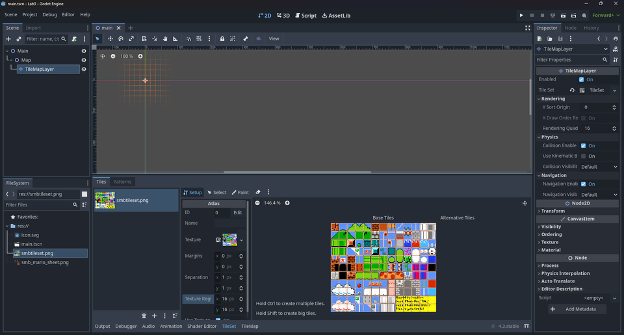
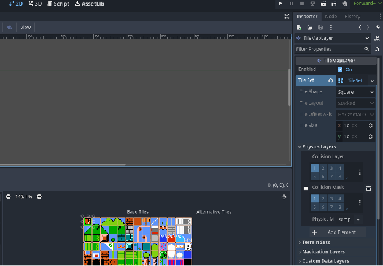
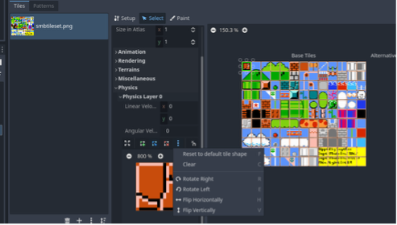
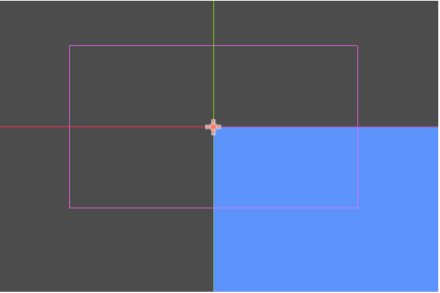
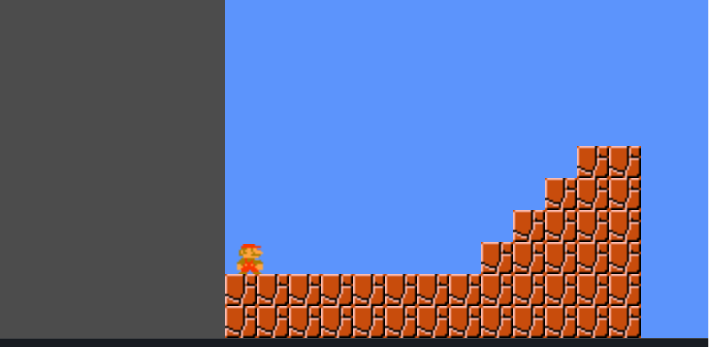
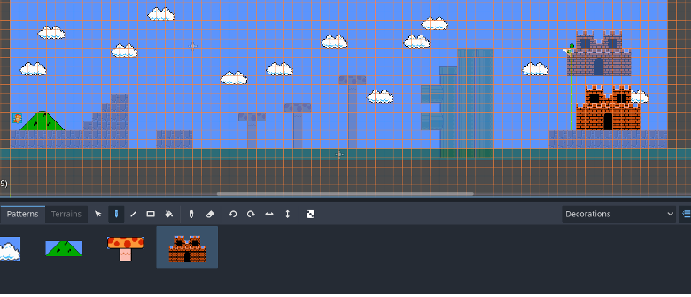

# Lab 3: Simple Platformer

### Due Monday, February 02 @ 11:59 PM

#### Goal: Learn TileMaps, TileSets, Scrolling, and Cameras

---

## Introduction

In this lab, we’ll create a simple **side-scrolling platformer**, inspired by classic *Super Mario*–style games.

You’ll learn how to build a **scrollable level** using TileMaps and TileSets, set up collisions directly on tiles, introduce a camera that follows the player, and manage larger game spaces.

Before you begin, grab the following sprite sheets from the **labs** GitHub repository:

 - Sprites:[`smb_sprites.png`](https://github.com/CS-2053-2026/Labs/blob/main/Lab-3/res/smb_sprites.png)
 - Tileset:[`smb_tiles.png`](https://github.com/CS-2053-2026/Labs/blob/main/Lab-3/res/smb_tiles.png)

> **Reminder:** This is **not** the repository where you submit your lab—this is just the same repo used in previous weeks for instructional assets and the instructions for the lab.

---

## Starting & Setup

Start by opening your project in Godot and setting the window size to **1280 × 720**.

Create your **main scene** as before and save it.

> Make sure both `smbtileset.png` and `smb_mario_sheet.png` are present in your project.

In your main scene lets start layering:

1. Add a new `Node2D` child of `main` named `Map`.
2. Add a `TileMapLayer` as a child of `Map`.

In the Inspector, find the **Tile Set** property.
It will be empty—create a **New TileSet**.

Once you do this, notice that two new tabs appear in the bottom panel:

The **TileSet**: the data backing your tiles.  
and **TileMap**: what you paint into the scene.

---

## Building the TileSet

Click the **TileSet** tab.

Drag `smbtileset.png` into the Tiles panel.
Godot will attempt to auto-slice the image, but it *might* need adjustment.

The tiles should have a `Texture Region` of **16 × 16 pixels**, and a `Separation` of **1 x 1 pixels**.



---

## Adding Physics to Tiles

Select the first brick tile (top-left, `0,0`) using the **Select** tool in the TileSet editor.

Tiles have many configurable options—animation, rendering, physics, and more. We’ll focus on physics for now.

In the `TileMapLayer` Inspector, expand the `TileSet` options (remember that this is one of those hidden sections that can be revealed by click directly on the `TileSet` name and not the dropdown arrow), next locate **Physics Layers** and add an `Element`.

Once added, a physics editing panel appears in the TileSet editor:



To make this brick act as solid ground, it needs a collision shape.

Expand the physics layer options until you see the zoomed-in tile view.
Open the menu (*three dots*) and select: **Reset to default tile shape**

This creates a full square collision polygon for the tile.



You should now see a red, semi-transparent square covering the entire tile.

> This collision shape defines how the tile interacts with physics.  
> Not all tiles should use a full square—keep that in mind for future projects.

---

## Painting the Level

Select the `TileMapLayer` node again.

Rename the Node for this TileMapLayer to `SolidObjects`, then duplicate it and rename the copy to `Decorations`.

In the **CanvasItem** section of the Inspector for each of the Nodes, locate **Ordering** → **Z Index**.

Set:

 - `SolidObjects` → *Z Index* **1**
 - `Decorations` → *Z Index* **0**

*This ensures solid tiles render above decorative ones.*

Select the SolidObjects node, and switch to the **TileMap** tab (at the bottom of the screen).
Make sure the draw tool is active (it's the pencil icon) and select the brick tile. 
*Confirm you’re painting on the `SolidObjects` layer*

Draw a basic floor inside the blue viewport outline.

Switch to the `Decorations` layer and fill the background with a sky-colored tile using the rectangle fill tool.

---

## Cameras

Test your scene.
Everything looks small?
Add a `Camera2D` node to the main scene.

Rather than scaling the world itself, we scale the **camera**, which avoids breaking physics and collisions.

In the Camera2D Inspector:

 - Set **Zoom** to `(2, 2)`
 - Adjust transform as desired *(for now)*

Notice how the purple camera outline shrinks.



Try running your scene again. If you don't see the bricks you drew, they are probably outside of the camera's view. Redraw some bricks inside the purple square. You can use the eraser tool to delete any blocks that are not visible by the camera.

Play the scene and fine-tune the zoom if needed.

---

## Player

Create a new **Player** scene like we did in the last lab.
But this time:

 - Root node: `CharacterBody2D`
 - Child node: `AnimatedSprite2D`

Use `smb_mario_sheet.png`.
Note that all sprites in the sheet are **NOT** the same size.
Some sprite sheets are not set up in uniform ways.
There are a number of ways to deal with this (we will use option 1):

 1. Use the slicing tool as we have but play with the settings, so you get the frames you need correctly selected.
 2. Crop the images in an external editor to get the frames you want, and save them as individual files.
 3. Use an Sprite and select different regions to create an animation by hand ([see this video if you are interested](https://www.youtube.com/watch?v=VlD7PtFIRlo&t=174s))

We recommend using option 1, which is just what you have been doing before, but in the inspector you can edit your values during slicing to get the frames we need selected correctly, see the image below.


 
Extract only the frames you need for each animation:

 - Running right (≈3 frames) *(take note of the frame speed)*
 - Standing (1 frame)
 - Jumping (1 frame)

This will handle all **right-facing** animations, but what about **left-facing**?
You can either:

 - Create left-facing animations, 

 **or**

 - Flip the sprite using `flip_h`

> Review Lab 2 if you need a refresher on slicing sprite sheets.

---

## CharacterBody2D Movement

When attaching a script to the player, select the **default** `CharacterBody2D` movement script.


This script already includes **gravity**, **jumping**, **speed**, and basic **input handling**.

*Read through the code carefully.*

You will need to:
- Modify input actions
- Adjust movement logic
- Trigger animations:
  - Jump animation when airborne
  - Idle animation when not moving
  - Running animation when moving on the ground

**AND** don't fotget to add a `CollisionShape2D` so the player can collide with tile-based ground.

---

## Falling and Resetting

If the player falls off the screen, reset the scene.

> **How?:** Many ways!
> *You could consider an invisible `Area2D` placed below the level!*

**Remember**: the player is no longer an `Area2D` like Lab 2.
Look through the **signals** available on other nodes to find a useful event.

---

## Scrolling Camera and Large Levels

The level is larger than the camera view—now the camera needs to follow the player.

Update the camera’s **x position** every frame (not physics frame) to track the player horizontally.

Once this works, you may see grey background outside the level:



Use the Camera2D **Limit** properties in the *Inspector* to clamp the visible area so the camera never shows empty space.

>**NOTE**: If you're lost, check the slides from the lecture on scrolling! 

---

## Expanding the Level

Now that scrolling works, build out the level:

- Add **at least** one new **solid tile type**
- Add **at least** one **decorative tile**
- Add a **goal**, such as a flag

*Ensure all solid tiles have appropriate physics shapes.*

> **Tip:**  You can select multiple tiles and save them as **Patterns** in the `TileMap` editor for quick reuse.



When the player reaches the goal, **reset** the scene.

---

## Multiple Levels and Scene Loading

Create a **second** level scene by copying or recreating the necessary nodes.

To change levels *(scenes)*, use:

```gdscript
get_tree().change_scene_to_file("res://level_2.tscn")
```

However, you’ll need to know **which level is currently loaded** to determine what comes next.

After completing **level 2**, loop back to **level 1**.

---

## Submission

Commit and **push** your project to GitHub.

Don’t forget to complete the required `.md` files (author, AI disclosure).

Good luck—and at this point, you should be starting to feel comfortable building small games!
