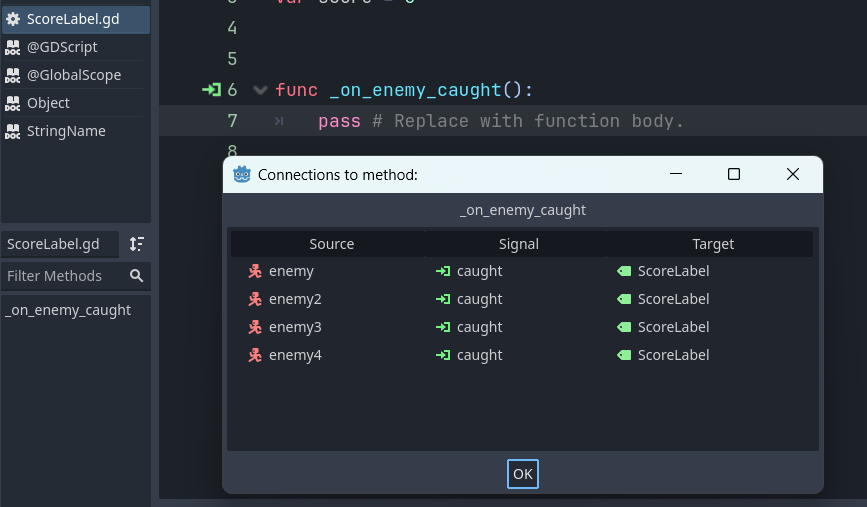

# Lab 0: Catch the Creeps

### Due the following Tuesday at 3pm

- Goal: set up Godot and practice engine basics by recreating a tutorial game.

## Introduction

- Install Godot 4.4.1 (non-.NET is fine); lab machines already have it.
- This tutorial is a simplified version of one from the official docs: <https://docs.godotengine.org/en/4.4/getting_started/first_3d_game/index.html> (we diverge slightly).
- Assets: download "squash_thecreeps_stat_1.1.0.zip" from the [1.1.0 release](https://github.com/Godotengine/Godot-3d-dodge-the-creeps/releases/tag/1.1.0).
- Project creation: in Godot, create a new project named "Lab0 - Collect The Creeps" in your CS2053 folder; Godot creates the directory for you.
- Reference screenshots:


- File system notes: root is `res` for resources. 
- Copy `art` and `fonts` from the unzipped assets into your project folder; they should appear in the FileSystem. Right-click → "open in file manager" to jump to the folder.

## Scene and Setup

- Note the Scene Hierarchy on the left. It should be prompting you to create a root node.
- Select \"Other Node\" and search for \"Node\" (a plain Node type) and select it. 
- It should now appear in the Scene as \"Node\", but renaming is good practice to help organize thing. 
- Right click the "Node" and selected rename from the menu and name it something to indicate its nature like \"main\".


## Player Actions

Follow the player scene creation as written below, and taken directly from the Godot tutorial. As an extra step, for your player character in the main scene, edit its transform to be slightly above the ground, say 1m. When making actions, let\'s skip the joystick part, but check back here and try it out if you want to use your own gamepads. For us, let\'s bind left to A (as in the tutorial), right to D, forward to W, and back to S. You can also use arrow keys, or do both arrows and the WASD keys.

Setting up the game area
========================
In this first part, we're going to set up the game area. Let's get started by importing the start assets and setting up the game scene.

We've prepared a Godot project with the 3D models and sounds we'll use for this tutorial, linked in the index page. If you haven't done so yet, you can download the archive here: [Squash the Creeps assets](https://github.com/godotengine/godot-docs-project-starters/releases/download/latest-4.x/3d_squash_the_creeps_starter.zip).

Once you downloaded it, extract the .zip archive on your computer. Open the Godot Project Manager and click the *Import* button.


In the import popup, enter the full path to the freshly created directory ``3d_squash_the_creeps_starter/``. You can click the *Browse* button on the right to open a file browser and navigate to the ``project.godot`` file the folder
contains.


Click *Import* to open the project in the editor.


A window notifying you that the project was generated by an older Godot version may appear. Click *OK* to convert the project to your current Godot version.


If it doesn't open immediately open the project from your project list.

The start project contains an icon and two folders: ``art/`` and ``fonts/``. There, you will find the art assets and music we'll use in the game.


There are two 3D models, ``player.glb`` and ``mob.glb``, some materials that belong to these models, and a music track.

Setting up the playable area
----------------------------

We're going to create our main scene with a plain `Node` as its root. In the *Scene* dock, click the *Add Child Node* button represented by a "+" icon in the top-left and double-click on *Node*. Name the node ``Main``. An alternate method to rename the node is to right-click on *Node* and choose *Rename* (or `F2`). Alternatively, to add a node to the scene, you can press `Ctrl + A` (`Cmd + A` on macOS).


Save the scene as ``main.tscn`` by pressing `Ctrl + S` (`Cmd + S` on macOS).

We'll start by adding a floor that'll prevent the characters from falling. To create static colliders like the floor, walls, or ceilings, you can use `StaticBody3D` nodes. They require `CollisionShape3D` child nodes to define the collision area. With the ``Main`` node selected, add a :ref:`StaticBody3D <class_StaticBody3D>` node, then a `CollisionShape3D`. Rename the `StaticBody3D` to ``Ground``.


Your scene tree should look like this


A warning sign next to the `CollisionShape3D` appears because we haven't defined its shape. If you click the icon, a popup appears to give you more information.


To create a shape, select the `CollisionShape3D ` node, head to the *Inspector* and click the *<empty>* field next to the *Shape* property. Create a new *BoxShape3D*.


The box shape is perfect for flat ground and walls. Its thickness makes it reliable to block even fast-moving objects.

A box's wireframe appears in the viewport with three orange dots. You can click and drag these to edit the shape's extents interactively. We can also precisely set the size in the inspector. Click on the `BoxShape3D` to expand the resource. Set its *Size* to ``60`` on the X-axis, ``2`` for the Y-axis, and ``60`` for the Z-axis.


Collision shapes are invisible. We need to add a visual floor that goes along with it. Select the ``Ground`` node and add a `MeshInstance3D` as its child.


In the *Inspector*, click on the field next to *Mesh* and create a `BoxMesh` resource to create a visible box.


Once again, it's too small by default. Click the box icon to expand the resource and set its *Size* to ``60``, ``2``, and ``60``.


You should see a wide grey slab that covers the grid and blue and red axes in the viewport.

We're going to move the ground down so we can see the floor grid. To do this, the grid snapping feature can be used. Grid snapping can be activated 2 ways in the 3D editor. The first is by pressing the *Use Snap* button (or pressing the `Y` key). `Ctrl` while still clicking to enable snapping as long as `Ctrl` is held.


Start by setting snapping with your preferred method. Then move the ``Ground`` node using the Y-axis (the green arrow on the gizmo).


    If you can't see the 3D object manipulator like on the image above, ensure
    the *Select Mode* is active in the toolbar above the view.


Move the ground down ``1`` meter, in order to have a visible editor grid. A label in the bottom-left corner of the
viewport tells you how much you're translating the node.


Moving the *Ground* node down moves both children along with it. Ensure you move the *Ground* node, **not** the *MeshInstance3D* or the *CollisionShape3D*.

Ultimately, ``Ground``'s transform.position.y should be -1


Let's add a directional light so our scene isn't all grey. Select the ``Main`` node and add a child node DirectionalLight3D.


We need to move and rotate the DirectionalLight3D node.
Move it up by clicking and dragging on the manipulator's green arrow and click and drag on the red arc to rotate it around the X-axis, until the ground is lit.

In the *Inspector*, turn on *Shadow* by clicking the checkbox.


At this point, your project should look like this.


That's our starting point. In the next part, we will work on the player scene and base movement.


Player Input
============

In the next parts, we will design the player scene, register custom input actions, and code player movement. By the end, you\'ll have a playable character that moves in eight directions.

Create a new scene by going to the **Scene** menu in the top-left and clicking **New Scene**.


Click the **Other Node** button and select the `CharacterBody3D` node type to create a `CharacterBody3D` as the root node.


Rename the `CharacterBody3D` to `Player`. Character bodies are complementary to the area
and rigid bodies used in the 2D game tutorial. Like rigid bodies, they can move and collide with the environment, but instead of being controlled by the physics engine, **you** dictate their movement. You will see how we use the node\'s unique features when we code the jump and squash mechanics.

For now, we\'re going to create a basic rig for our character\'s 3D model. This will allow us to rotate the model later via code while it plays an animation.

Add a `Node3D <class_Node3D>`{.interpreted-text role="ref"} node as a child of `Player`. Select the `Player` node in the **Scene** tree and click the `+` button to add a child node. Rename it to `Pivot`.


Then, in the FileSystem dock, expand the `art/` folder by double-clicking it and drag and drop `player.glb` onto `Pivot`.


This should instantiate the model as a child of `Pivot`. You can rename it to `Character`.


The `.glb` files contain 3D scene data based on the open source glTF 2.0 specification. They\'re a modern and powerful alternative to a proprietary format like FBX, which Godot also supports. To produce these files, we designed the model in [Blender 3D](https://www.blender.org/) and exported it to glTF.


As with all kinds of physics nodes, we need a collision shape for our character to collide with the environment. Select the `Player` node again and add a child node `CollisionShape3D`. In the **Inspector**, on the **Shape** property, add a new `SphereShape3D`.


The sphere\'s wireframe appears below the character.


It will be the shape the physics engine uses to collide with the environment, so we want it to better fit the 3D model. Make it a bit larger by dragging the orange dot in the viewport. My sphere has a radius of about `0.8` meters.

Then, move the collision shape up so its bottom roughly aligns with the grid\'s plane.


To make moving the shape easier, you can toggle the model\'s visibility by clicking the **eye icon** next to the `Character` or the `Pivot` nodes.


Save the scene as `player.tscn`.

With the nodes ready, we can almost get coding. But first, we need to define some input actions.

## Creating input actions 

To move the character, we will listen to the player\'s input, like pressing the arrow keys. In Godot, while we could write all the key bindings in code, there\'s a powerful system that allows you to assign a label to a set of keys and buttons. This simplifies our scripts and makes them more readable.

This system is the Input Map. To access its editor, head to the
**Project** menu and select **Project Settings\...**.


At the top, there are multiple tabs. Click on **Input Map**. This window allows you to add new actions at the top; they are your labels. In the bottom part, you can bind keys to these actions.


Godot projects come with some predefined actions designed for user interface design (see above screenshot). These will become visible if you enable the **Show Built-in Actions** toggle. We could use these here, but instead we\'re defining our own to support gamepads. Leave **Show Built-in Actions** disabled.

We\'re going to name our actions `move_left`, `move_right`, `move_forward`, `move_back`, and `jump`. These are special names that the `move_and_slide` function we will call looks for.

To add an action, write its name in the bar at the top and press Enter or click the **Add** button.


Create the following five actions:


To bind a key or button to an action, click the `+` button to its right. Do this for `move_left`. Press the left arrow key and click **OK**.


Bind also the `A` key, onto the action `move_left`.


    NOTE: You can skip this part for adding the joystick support. 

Let\'s now add support for a gamepad\'s left joystick. Click the `+` button again but this time, select the input within the input tree yourself. Select the negative X axis of the left joystick under **Joypad Axes**.


Leave the other values as default and press **OK**.

    If you want controllers to have different input actions, you should use the Devices option in Additional Options. Device 0 corresponds to the first plugged gamepad, Device 1 corresponds to the second plugged gamepad, and so on.


Do the same for the other input actions. For example, bind the right arrow, D, and the left joystick\'s positive axis to `move_right`. After binding all keys, your interface should look like this.


The final action to set up is the `jump` action. Bind the Space key and the gamepad\'s A button located under **Joypad Buttons**.


Your jump input action should look like this.


That\'s all the actions we need for this game. You can use this menu to label any groups of keys and buttons in your projects.

In the next part, we\'ll code and test the player\'s movement.

Scripting - Player Movement
=========

Until now, we\'ve been using the editor almost entirely. As discussed in class, some things are easier to do with the editor, and some within code. One is not better than the other, each has its roles. You will need to get used to switching back and forth between coding and editing. That said, let\'s get into Godot coding.

For Godot, you can code in Godot Script (GDScript), or C#. Godot Script is quite nice to learn if you want, and C# is nice as it can be used more generally and in other game engines, including Unity. However, the built-in code editor does not support autocomplete for C# and .NET version compatibility can be an issue. In general, Godot supports its own scripting language better. If you wish to try C#, you are welcome to do so but you will support yourself - supporting you if you choose C# might be difficult. 

If you wish to enable autocomplete for Godot in another editor, see https://docs.Godotengine.org/en/stable/tutorials/scripting/c_sharp/c_sharp_basics.html#configuring-an-external-editor otherwise, you can code without it or use GDScript. For this class, we will use GDScript, which is similar to Python. I also recommend using the built-in code editor until you become more comfortable with Godot.

### Adding a Jump
Test your code, you should be able to move your player in 8 directions.

But wait... We defined a jump action without filling out its functionality! At the top of the Player script, where we define our constants, add:

```gdscript
# Vertical impulse applied to the character upon jumping in meters per second.
@export var jump_impulse = 20
```
And inside the `_physics_process` method, below the other input logic, add:

```gdscript
# Jumping.
if is_on_floor() and Input.is_action_just_pressed("jump"):
    target_velocity.y = jump_impulse
```
This will pop give our character a burst of vertical speed, but only if they are currently on the ground. No double jumps, rocket jumps, or flying here! Test it out - you should be able to jump now. Make sure you are in the Main scene when you run the game.

Having trouble? Ask the instructor or TA. Also, note you can access the built-in documentation by highlighting an object type, method, etc, right clicking, and selecting \"Lookup symbol\" - it\'s very handy! A shortcut for this is holding ctrl while you left-click on the variable/method/type. Also, the editor has a built-in debugger which is very useful. It\'s good to get familiar with these things, and to review your debugger skills if you have already taken CS2263.

## Adding Enemies

Now let\'s change our window size, just to make sure our game space is sized consistently. To do this, select Project- \> Project Settings -\> General Tab -\> Display -\> Window. One of the first options is \"size\". Change the Viewport Height and width to 540 and 720
respectively.

Create an enemy like you did the player, making its own scene, importing the model (use mob.glb), making a collision box, and saving the scene. For clarity, lets rename everything the tutorial called "mob" to instead be "enemy". 

Now, back in your main scene, we will create 4 enemies around the player, something like this:


Note I\'ve also set these enemies to be the same height above the ground for now: 1 m. Try out your game. The enemies look a bit boring because they don\'t move. Let\'s change that!

Note you already made 4 enemies by tediously instantiating child scenes multiple times. It would be a pain to update them all right? Luckily, if we edit the base scene, it will automatically update all other instances of that scene! So, let\'s return to the enemy scene you made, right click the base node and add an empty GDScript.

This will be quite basic. First, let\'s add an editable variable:
rotation_speed:

```gdscript
@export var rotation_speed = 1
```
Then, we\'ll make our process update with the physics engine:

```gdscript
func _physics_process(delta):
    transform = transform.rotated_local(up_direction, rotation_speed\*delta)
```

Why multiply by delta? Try it without! Inspect the ```_physics_process``` function and see what API says about its argument - it\'s the time since the last physics engine update, and this can be very quick, and also inconsistent. We\'ll talk about this later in class about the game loop.

Note while in an object, we have access to all its properties. The \"transform\" variable is the same transform that is in its Node3D (see the inspector tab), and we can access it with its variable name directly. This let\'s us leverage a lot of built-in functions the Godot engine has developed for common game dev needs. Once again, get familiar and comfortable accessing and searching the API, it will save you a lot of time!

Save your enemy scene with the new script. Go back to your main scene and note that all your enemies have been updated to have the script you attached. Handy!

Try your game. The enemies should spin on the spot. You can also try to transform other ways\...try rotated() instead of rotated_local()\...what is different? Can you think of why?

## Collisions

Godot physics works on a relatively unique system of masks and layers. Simply, every object that can interact with other objects physically must belong to a layer, and that layer can only interact with objects on layers specified in its Mask. For example, you may have Coins to pickup for an Italian Plumber character, and enemies to jump on. You could make a layer for the player, one for the pickups, and one for the enemies.

You could set the player to interact with both the pickup layer and the enemy layer, but perhaps you would not allow the enemies to interact with pickups, so you would not include the pickup layer in the enemy mask, or vice versa.

For this simple lab, we will have three layers: one for the enemies, one for the world environment, and one for the player. 

 - Open project settings, and scroll down on the left menu in the General tab to find Layer Names. 
 - Select 3D physics (because we are making a 3D game with 3D assets), and name Layer 1 to be `player` and layer 2 to be `enemies`, and layer 3 to be `world`
 - Return to the player scene and select the player top level node. 
 - In the inspector (by default, the right-hand menu), note you can see all the subnode properties as well. 
 - In the CollisionObject3D menu, expand \"Collision\" and you will see by default this node is on layer 1 and its mask contains only 1. 
 - Layer 1 is supposed to be for the player, so let\'s leave it on that layer. 
 - For the mask, we should ask \"what objects can the player interact with?\" In this lab, it will be everything! So let\'s make sure layers 1, 2, and 3 are selected in the mask.
 - If you forget which is which, holding the mouse over the mask number will show your layer name we just added.

Let\'s do the Enemy Scene next.
- It should be on layer 2, and the Ground in the main scene should be on layer 3, but what should they interact with? 
- For now, let\'s make their masks also 1, 2, and 3, but this is something to consider for later.

Now, all our objects should be able to interact with each other. So how does this work? Well, we can look up what an object collided with every frame. But how do we tell if we collided with the floor (from falling) or by catching the enemy?

## Groups

Groups are a powerful way to tag different types of nodes so that they are easy to look up in a variety of situations. 

- Go to the enemy scene, and in the inspector tab, note there is another tab beside it called \"Node\". 
- Go to it, and select \"Groups\" right under it. Create a group \"enemy\". 
- Make sure you are on the enemy scene when you do this as it adds the current scene to the group.

Now, we can see if the player has collided with this group. Return to the main scene and re-open your player script.

We\'re going to add more to our \_physics_process function, but it\'s getting a little large, so let\'s put this new code in its own function, which I called \_handleCollisions(). 
Don\'t forget to call this from your \_physics_process function!

Your collision handler should look something like this:

```gdscript
func handleCollisions():

    # Iterate through all collisions that occurred this frame
    for  index in range(get_slide_collision_count()):

    # We get one of the collisions with the player
    var collision = get_slide_collision(index)

    #for reasons we won't go into here, collision detection is
    #complicated and we may get a null collision, skip it!
    if collision.get_collider() == null:
        continue

    # If the collider is with an enemy
    if collision.get_collider().is_in_group(\"enemy\"):
        var enemy = collision.get_collider()
        enemy.catch()

    # Prevent further duplicate calls.
```
The comments should be explanatory. Note how we can check if an object we collided with is in a group. Any Node can be in a group, so this is quite useful to sort through your nodes, and you can make many groups if it helps you. Note we also asked to call a catch() function we haven\'t defined yet. Let\'s add it to our enemy script.

Add this at the top of your script to define a *Signal*:

```gdscript
# Emitted when the player jumped on the mob. signal caught

# you're old code here
func catch():
    #sends the signal that an enemy has been caught
    caught.emit() 
    #delete this node later this frame
    queue_free() 
```
This emits the signal, so we can take actions elsewhere because of this, then cleans up the enemy node.

Try your code, you should be able to intersect with the enemies and catch them. If you simply go over top of them, make sure your player or enemy collision spheres are large enough to touch.

## Scoring (UI) 

We have to keep track of the current score in a variable and display it on screen using a minimal interface. We will use a text label to do that.

In the main scene, add a new child node `Control <class_Control>`{.interpreted-text role="ref"} to `Main` and name it `UserInterface`. Ensure you are on the 2D screen, where you can edit your User Interface (UI).

Add a `Label <class_Label>`{.interpreted-text role="ref"} node and name it `ScoreLabel`


In the *Inspector*, set the *Label*\'s *Text* to a placeholder like \"Score: 0\".


Also, the text is white by default, like our game\'s background. We need to change its color to see it at runtime.

Scroll down to *Theme Overrides*, and expand *Colors* and enable *Font Color* in order to tint the text to black (which contrasts well with the white 3D scene).


Finally, click and drag on the text in the viewport to move it away from the top-left corner.


The `UserInterface` node allows us to group our UI in a branch of the scene tree and use a theme resource that will propagate to all its children. We\'ll use it to set our game\'s font.

## Creating a UI theme

Once again, select the `UserInterface` node. In the *Inspector*, create
a new theme resource in *Theme -\> Theme*.


Click on it to open the theme editor In the bottom panel. It gives you a preview of how all the built-in UI widgets will look with your theme resource.


By default, a theme only has a few properties: *Default Base Scale*, *Default Font* and *Default Font Size*.


The *Default Font* expects a font file like the ones you have on your computer. Two common font file formats are TrueType Font (TTF) and OpenType Font (OTF).

In the *FileSystem* dock, expand the `fonts` directory and click and drag the `Montserrat-Medium.ttf` file we included in the project onto the *Default Font*. The text will reappear in the theme preview.

The text is a bit small. Set the *Default Font Size* to `22` pixels to increase the text\'s size.


## Keeping track of the score

Let\'s work on the score next. Attach a new script to the `ScoreLabel` and define the `score` variable.

```gdscript
extends Label

var score = 0
```

Okay, now that we have your score text, we need it to change as we catch the creeps. In Godot, we can create events (Signals) that others can react to. This is part of the Observer software design pattern, and enables Event Based Programming which is very useful for games as they have to react to many things dynamically.

- Now click on one of your enemies. In the right-hand inspector menu, switch to the Node tab and underneath it, select Signals. 
- These are all the signals the node you selected can emit. Note you should be able to see \"Caught\", which we made earlier during the collision section.
- Double click caught() and it will prompt you in a new window to create a function. You\'ll see your scene tree - find ScoreLabel and select it with "connect"


This will take you back to your ScoreLabel.gd with a new function. Now, every time the "caught" signal is emitted (remember, this is emitted when the player collides with an enemy), this function will be called. 

Handy! Do this for all 4 enemies. However, note that when you try to connect the signal to a function for enemy2-4, it tries to create a new function like ```_on_enemy2_caught()```. 

That's no good -- we want the same function to be called for all of them. While ScoreLabel is selected in
the Connect dialogue (see the above image), pick \"Pick\" and select the ```_on_enemy_caught()``` function you already made. Repeat this for all 4 enemies, selecting ```_on_enemy_caught()``` each time. You *may* need to leave the script view each time for this dialogue to pop up -- just swap to the 3D view from the toolbar at the top of the window.

We\'ll find out how to do this programmatically in another lab. For static game assets, this dialog is the easiest way to do it.

Now all 4 enemies should be connected to the `_on_enemy_caught` function. To check this, look at the function code in ScoreLabel\.gd. You should now see a small green link symbol by the function. By double-clicking it you can see all signals linked to this function.



There! Now let\'s update the score and text when a creep is caught. Change the function 

`gdscript _on_enemy_caught():`

```gdscript
    func _on_enemy_caught():
        score += 1
        text = "Score: %s" % score
```
Test your code. Your score should now update as you catch creeps!

## Ending and restarting the game

If you want to restart the game, currently you have to close and reopen the game. Let's add a popup message window when the player finishes and a restart
button.

Right-click your root UI node and add a child, \"Accept Dialog\" and name it \"WinScreen\". It will default to invisible so you can\'t see it. In the inspector, change the OK Button Text to \"Restart\" and add a congratulatory text like \"You win!!!\" in the \"text\" field. Finally, in the Window option pane, change \"Initial Position\" to a nice option like \"Center of primary scene\" or something that looks good to you.

Now, let\'s make it appear on win. In the ScoreLabel script, add a new variable:

```@export var winScreen : AcceptDialog```

This tells Godot this variable should be a Godot Node of type AcceptDialog. Save, and you should see WinScreen in the inspector (you may need click to a new node and back to refresh it). Drag the WinScreen node from the scene tree to this variable. This is assigning the Node to that variable at game setup. In the enemy_caught function, we can now make it visible when we meet the max score.

```gdscript
@export var MAX_SCORE = 4

@export var winScreen : AcceptDialog

#...old code here
func _on_enemy_caught():
    score += 1
    text = "Score: %s" % score
    if score == MAX_SCORE:
    winScreen.visible = true
```
You can test your code. When the game ends, your dialog should become visible, but that's it, even if you hit okay, nothing happens. Let's change that.

Now, click the WinScreen node in the scene tree and connect its confirmed() signal to a new function we\'ll make in the scoreLabel.gd script. That function will simply reset the main scene tree:

```gdscript
func _on_win_screen_confirmed():
    get_tree().reload_current_scene()
```
Try it out!

## Recap

Phew! That was a lot!!! It's okay if many things seemed confusing to you this time. Try to go over the code and things we did in the inspector. Change some code or values and see what happens. We'll be repeating a lot of these things, learning more about some of them, and just getting used to others. However, you should be able to make some basic things now in Godot! Remember to consider what you can do in the editor, the inspectors, and code.

Reflect on what you\'ve done. We\'ve learned about:

- Godot Nodes and the Scene Tree
- Collision shapes, meshes, handling collisions
- the _physics_process() function, move_and_slide()
- Basic Lights
- Input
- Scenes as sub-components in a main scene
- Adding meshes
- Camera basics
- Attaching scripts
- Basic Godot scripting
- Communicating between nodes with Signals
- Basic UI
- Event based programming
  
Now, you may be confused by much of this, but we\'ll get more familiar over time. However, I really encourage playing around with this game, adding things, and keeping it handy to refer back to as you go on.

Want more to do? Well here are some ideas, in order of challenge:

## Extra Challenges (Optional)

1)  A) Try to make the enemies move as well to make the game more challenging.
    B) Can you make the enemies only interact with the player and not other enemies? *Hint*: think of Masks!

2)  Can you stop player movement when the Win screen pops up? *Hint*: add a Signal!

3)  For *extra* challenge, only allow yourself to catch them by jumping on top of them. If you do this, try making non-jump collisions \"kill\" the player (game over)

 - the additions above are actually in the full tutorial, but try to figure it out yourself!
 - of course, you can always just look at the full tutorial

4)  Make enemies move in random paths
