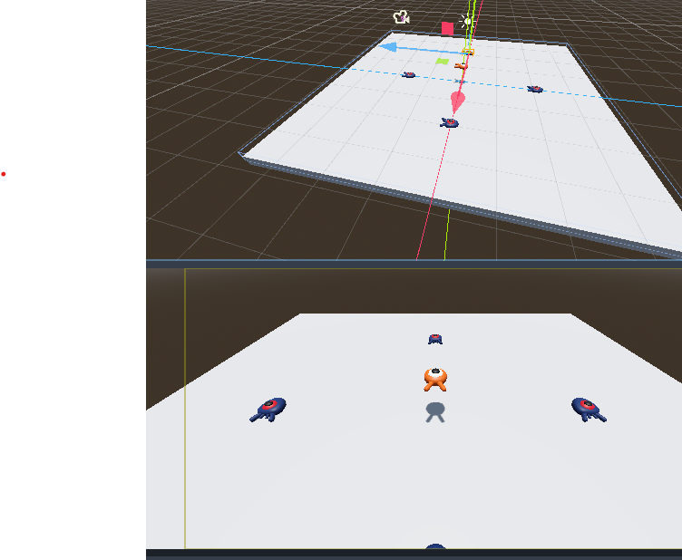

# Lab 0: Catch the Creeps - Part 1

## Due the following Monday at 11:59pm

### **Goal**: Set up Godot and practice engine basics by recreating a tutorial game.
---
## Introduction

- Install **Godot 4.4.1**; lab machines already have it.
- This tutorial is a simplified version of one from the official docs.
- **Assets**:
  - download "squash_thecreeps_stat_1.1.0.zip" from the [1.1.0 release](https://github.com/Godotengine/Godot-3d-dodge-the-creeps/releases/tag/1.1.0).
- **Project creation**:
  - We started an empty Godot project for you.
  - Clone the repo and open in Godot.
  - You should have a project called `labo`
- *File system note*: root is `res` for resources. 
- Copy `art` and `fonts` from the unzipped assets into your project folder; they should appear in the FileSystem.
  - Right-click → "open in file manager" to jump to the folder.

## Scene & Setup

- Note the Scene Hierarchy on the left. It should be prompting you to create a root node.
- Select \"Other Node\" and search for \"Node\" (a plain Node type) and select it. 
- It should now appear in the Scene as \"Node\", but renaming is good practice to help organize thing. 
- Right click the "Node" and selected rename from the menu and name it something to indicate its nature like \"main\".
- Save the scene as ``main.tscn`` by pressing `Ctrl + S` (`Cmd + S` on macOS).

### Environment

We'll start by adding a floor that'll prevent the characters from falling. To create static colliders like the floor, walls, or ceilings, you can use `StaticBody3D` nodes. They require `CollisionShape3D` child nodes to define the collision area. With the ``Main`` node selected, add a :ref:`StaticBody3D` node, then a `CollisionShape3D`. Rename the `StaticBody3D` to ``Ground``.


Your scene tree should look like this


A warning sign next to the `CollisionShape3D` appears because we haven't defined its shape. If you click the icon, a popup appears to give you more information.


To create a shape, select the `CollisionShape3D ` node, head to the *Inspector* and click the *<empty>* field next to the *Shape* property. Create a new *BoxShape3D*.


The box shape is perfect for flat ground and walls. Its thickness makes it reliable to block even fast-moving objects.

A box's wireframe appears in the viewport with three orange dots. You can click and drag these to edit the shape's extents interactively. We can also precisely set the size in the inspector. Click on the `BoxShape3D` to expand the resource. Set its *Size* to ``60`` on the X-axis, ``2`` for the Y-axis, and ``60`` for the Z-axis.


Collision shapes are invisible. We need to add a visual floor that goes along with it. Select the ``Ground`` node and add a `MeshInstance3D` as its child.


In the *Inspector*, click on the field next to *Mesh* and create a `BoxMesh` resource to create a visible box.


Once again, it's too small by default. Click the box icon to expand the resource and set its *Size* to ``60``, ``2``, and ``60``.


You should see a wide grey slab that covers the grid and blue and red axes in the viewport.

We're going to move the ground down so we can see the floor grid. To do this, the grid snapping feature can be used. Grid snapping can be activated 2 ways in the 3D editor. The first is by pressing the *Use Snap* button (or pressing the `Y` key). `Ctrl` while still clicking to enable snapping as long as `Ctrl` is held.


Start by setting snapping with your preferred method. Then move the ``Ground`` node using the Y-axis (the green arrow on the gizmo).


    If you can't see the 3D object manipulator like on the image above, ensure
    the *Select Mode* is active in the toolbar above the view.


Move the ground down ``1`` meter, in order to have a visible editor grid. A label in the bottom-left corner of the
viewport tells you how much you're translating the node.


Moving the *Ground* node down moves both children along with it. Ensure you move the *Ground* node, **not** the *MeshInstance3D* or the *CollisionShape3D*.

Ultimately, ``Ground``'s transform.position.y should be -1


Let's add a directional light so our scene isn't all grey. Select the ``Main`` node and add a child node DirectionalLight3D.


We need to move and rotate the DirectionalLight3D node.
Move it up by clicking and dragging on the manipulator's green arrow and click and drag on the red arc to rotate it around the X-axis, until the ground is lit.

In the *Inspector*, turn on *Shadow* by clicking the checkbox.


At this point, your project should look like this.


That's our starting point. In the next part, we will work on the player scene and base movement.


## Player Input

In the next parts, we will design the player scene, register custom input actions, and code player movement. By the end, you\'ll have a playable character that moves in eight directions.

Create a new scene by going to the **Scene** menu in the top-left and clicking **New Scene**.


Click the **Other Node** button and select the `CharacterBody3D` node type to create a `CharacterBody3D` as the root node.


Rename the `CharacterBody3D` to `Player`. 

Character bodies can move and collide with the environment, You will see how we use this when we code the jump and squash mechanics.

For now, we\'re going to create a basic rig for our character\'s 3D model. This will allow us to rotate the model later via code while it plays an animation.

Add a `Node3D` node as a child of `Player` and rename it to `Pivot`.


Then, in the FileSystem dock, expand the `art/` folder by double-clicking it and drag and drop `player.glb` onto `Pivot`.


This should instantiate the model as a child of `Pivot`. You can rename it to `Character`.


The `.glb` files contain 3D scene data based on the open source glTF 2.0 specification. They\'re a modern and powerful alternative to a proprietary format like FBX, which Godot also supports. To produce these files, they can be designed in software like [Blender 3D](https://www.blender.org/) and then exported it to glTF.

As with all kinds of physics nodes, we need a collision shape for our character to collide with the environment. Select the `Player` node again and add a child node `CollisionShape3D`. In the **Inspector**, on the **Shape** property, add a new `SphereShape3D`.


The sphere\'s wireframe appears below the character.


It will be the shape the physics engine uses to collide with the environment, so we want it to better fit the 3D model.

Make it a bit larger by dragging the orange dot in the viewport. My sphere has a radius of about `0.8` meters.

Then, move the collision shape up so its bottom roughly aligns with the grid\'s plane.


To make moving the shape easier, you can toggle the model\'s visibility by clicking the **eye icon** next to the `Character` or the `Pivot` nodes.


Save the scene as `player.tscn`.

With the nodes ready, we can almost get coding. But first, we need to define some input actions.

## Creating input actions 

To move the character, we will listen to the player\'s input, like pressing the arrow keys.
In Godot, while we could write all the key bindings in code, there\'s a powerful system that allows you to assign a label to a set of keys and buttons.
This simplifies our scripts and makes them more readable.

This system is the Input Map. To access its editor, head to the
**Project** menu and select **Project Settings\...**.


At the top, there are multiple tabs. Click on **Input Map**.
This window allows you to add new actions at the top; they are your labels. In the bottom part, you can bind keys to these actions.


Godot projects come with some predefined actions designed for user interface design (see above screenshot).
These will become visible if you enable the **Show Built-in Actions** toggle.
We could use these here, but instead we\'re defining our own to support gamepads.
Leave **Show Built-in Actions** disabled.

We\'re going to name our actions `move_left`, `move_right`, `move_forward`, `move_back`, and `jump`.
These are special names that the `move_and_slide` function we will call looks for.

To add an action, write its name in the bar at the top and press Enter or click the **Add** button.


Create the following five actions:


To bind a key or button to an action, click the `+` button to its right. Do this for `move_left`. Press the left arrow key and click **OK**.


Bind also the `A` key, onto the action `move_left`.


Do the same for the other input actions. For example, bind the right arrow and `D` key to `move_right`.
After binding all keys, your interface should look like this.
*You can ignore the joypad entries*


The final action to set up is the `jump` action by binding the Spacebar.


That\'s all the actions we need for this game.
You can use this menu to label any groups of keys and buttons in your projects.

In the next part, we\'ll code and test the player\'s movement.

## Scripting - Player Movement

Until now, we\'ve been using the editor almost entirely.
While this is great, some things are easier done with code. One is not better than the other, each has its roles. You will need to get used to switching back and forth between coding and editing.
That said, let\'s get into Godot coding.

> In Godot, you can code in Godot Script (**GDScript**), or **C#**.
Godot Script is quite nice to learn if you want, and C# is nice as it can be used more generally and in other game engines, including Unity. However, the built-in code editor does not support autocomplete for C# and .NET version compatibility can be an issue. In general, Godot supports its own scripting language better. If you wish to try C#, you are welcome to do so, but for this class it's *highly* recommended to use GDScript, as we will use it for all exmaples and starter code.

Right-click the `Player` node and select Attach Script to add a new script to it.
In the popup, set the Template to Empty before pressing the Create button.
We set it to Empty because we want to write our own code for player movement.


Let's start with the class's properties.
We're going to define a movement **speed**, a fall **acceleration** representing gravity, and a **velocity** we'll use to move the character.

```gdscript
extends CharacterBody3D

# How fast the player moves in meters per second.
@export var speed = 14
# The downward acceleration when in the air, in meters per second squared.
@export var fall_acceleration = 75

var target_velocity = Vector3.ZERO
```
These are common properties for a moving body.
The **target_velocity** is a 3D vector combining a speed with a direction.
Here, we define it as a property because we want to update and reuse its value across frames.

Let's code the movement.
We start by calculating the input direction vector using the global `Input` object, in `_physics_process()`.

```gdscript
func _physics_process(delta):
	# We create a local variable to store the input direction.
	var direction = Vector3.ZERO

	# We check for each move input and update the direction accordingly.
	if Input.is_action_pressed("move_right"):
		direction.x += 1
	if Input.is_action_pressed("move_left"):
		direction.x -= 1
	if Input.is_action_pressed("move_back"):
		# Notice how we are working with the vector's x and z axes.
		# In 3D, the XZ plane is the ground plane.
		direction.z += 1
	if Input.is_action_pressed("move_forward"):
		direction.z -= 1
```
Here, the `_physics_process()` virtual function is designed specifically for physics-related code like moving a kinematic or rigid body.
It updates the node using fixed time intervals.

We start by initializing a direction variable to `Vector3.ZERO`.
Then, we check if the player is pressing one or more of the `move_*` inputs and update the vector's `x` and `z` components accordingly.
 These correspond to the ground plane's axes.

These four conditions give us eight possibilities and eight possible directions.

In case the player presses, say, both `<` and `>` simultaneously, the vector will have a length of about 1.4. But if they press a single key, it will have a length of 1. We want the vector's length to be consistent, and not move faster diagonally.
To do so, we can call its normalized() method.

```gdscript
func _physics_process(delta):
	#...
	if direction != Vector3.ZERO:
		direction = direction.normalized()
		# Setting the basis property will affect the rotation of the node.
		$Pivot.basis = Basis.looking_at(direction)
```

We only normalize the vector if the direction has a length greater than zero, which means the player is pressing a direction key.

We compute the direction the `$Pivot` is looking by creating a *Basis* that looks in the `direction` direction.

Then, we update the `velocity`. We have to calculate the ground velocity and the fall speed separately.

```gdscript
func _physics_process(delta):
	#...
	if direction != Vector3.ZERO:
		#...

	# Ground Velocity
	target_velocity.x = direction.x * speed
	target_velocity.z = direction.z * speed

	# Vertical Velocity
	if not is_on_floor(): # If in the air, fall towards the floor. Literally gravity.
		target_velocity.y = target_velocity.y - (fall_acceleration * delta)

	# Moving the Character
	velocity = target_velocity
	move_and_slide()
```
The `CharacterBody3D.is_on_floor()` function returns true if the body collided with the floor in this frame, so we apply gravity to the `Player`conly while in the air.

For the vertical velocity, we subtract the fall acceleration multiplied by the delta time every frame, causing our character to fall every frame, as long as it is not on or colliding with the floor.

On the last line, we call `CharacterBody3D.move_and_slide()` which is a powerful method of the `CharacterBody3D` class that allows you to move a character smoothly.
We'll talk more about this later.

#### Testing our player's movement

To test, we need to **instantiate** the player and then add a camera. Without this, you won't see anything if your viewport if you run.

Save your Player scene and open the Main scene.
You can click on the Main tab at the top of the editor to do that.

To instantiate the `Player`, right-click on the `Main` node and select `Instantiate Child Scene`.

In the popup, double-click `player.tscn`.
The character should appear in the center of the viewport.

#### Adding a camera

Like we did with our `Player`'s `Pivot`, we're going to create a basic **rig**.
Right-click on the `Main` node again and select `Add Child Node`.
Create a new `Marker3D`, and name it **CameraPivot**. Select `CameraPivot` and add a child node `Camera3D` to it.
Your scene tree should look similar to this.


> **Notice**
A *Preview* checkbox appears in the top-left of the 3D view when you have the Camera selected.
*You can click it to preview the in-game camera projection.*

We're going to use the `Pivot` to rotate the camera as if it was on a crane.
Let's first split the 3D view to be able to freely navigate the scene and see what the camera sees.

In the toolbar right above the viewport, click on **View**, then **2 Viewports**.

On the bottom view, select your `Camera3D` and turn on camera **Preview** by clicking the checkbox.

Here's where the magic happens.
In the top view, make sure your `Camera3D` is selected and move the camera a bit about the Z axis (drag the blue arrow).
Select the `CameraPivot` and rotate it -45 degrees around the X axis (using the red circle).
You'll see the camera move as if it was attached to a crane.
*Magic*.

> You can now run the scene by pressing **cmd/ctr+r** or the "**Run Current Scene**" button in the title bar.
Now press the arrow keys to move the character!

### Adding a Jump

But wait... We defined a jump action without filling out its functionality! At the top of the Player script, where we define our constants, add:

```gdscript
# Vertical impulse applied to the character upon jumping in meters per second.
@export var jump_impulse = 20
```
And inside the `_physics_process` method, below the other input logic, add:

```gdscript
# Jumping.
if is_on_floor() and Input.is_action_just_pressed("jump"):
    target_velocity.y = jump_impulse
```
This will pop give our character a burst of vertical speed, but only if they are currently on the ground.
No double jumps, rocket jumps, or flying here!
Test it out - you should be able to jump now.
*Make sure you are in the **Main** scene when you run the game*.

> #### Having trouble?
> **Ask the instructor or TA.**
Also, note you can access the built-in documentation by highlighting an object type, method, etc, right clicking, and selecting \"Lookup symbol\" - it\'s very handy!
A shortcut for this is holding ctrl while you left-click on the variable/method/type.
Also, the editor has a built-in debugger which is very useful.
It\'s good to get familiar with these things, and to review your debugger skills if you have already taken CS2263.

## Polish & Adding Enemies

First, let\'s change our window size, just to make sure our game space is sized consistently.
To do this, select:
```Project -> Project Settings -> General Tab -> Display -> Window.```
One of the first options is \"size\".
Change the Viewport width & height to **720** and **540** respectively.

Create an **enemy** like you did the player, making its own scene, importing the model *(use `mob.glb`)*, making a collision box, and saving the scene.

Now, back in your main scene, we will create 4 enemies around the player, something like this:



Note we\'ve also set these enemies to be the same height above the ground for now: 1 m.

Try out your game.
The enemies look a bit boring because they don\'t move.
**Let\'s change that!**

Note you already made 4 enemies by tediously instantiating child scenes multiple times.
It would be a pain to update them all right? 
Luckily, if we edit the base scene, it will automatically update all other instances of that scene!
So, let\'s return to the enemy scene you made, right click the base node and add an empty GDScript.

This will be quite basic. First, let\'s add an editable variable:
rotation_speed:

```gdscript
@export var rotation_speed = 1
```
Then, we\'ll make our process update with the physics engine:

```gdscript
func _physics_process(delta):
    transform = transform.rotated_local(up_direction, rotation_speed * delta)
```

Why multiply by delta?
*Try it without!*
Inspect the `_physics_process` function and see what API says about its argument - it\'s the time since the last physics engine update, and this can be very quick, and also inconsistent. We\'ll talk about this later in class about **the game loop**.

> **Note!**
 While in an object, we have access to all its properties. The \"transform\" variable is the same transform that is in its `Node3D`, and we can access it with its variable name directly.
 This let\'s us leverage a lot of built-in functions the Godot engine has developed for common game dev needs.
 Once again, get familiar and comfortable accessing and searching the API, it will save you a lot of time!

Save your enemy scene with the new script.
Go back to your main scene and note that all your enemies have been updated to have the script you attached.
**Handy!**

Try your game again.
The enemies should spin on the spot.
You can also try to transform other ways\...try `rotated()` instead of `rotated_local()`
...what is different?
*Can you think of why?*

#### That's all for now!

## Except...
Don't forget to practice pushing your code!
And checking you push!
_this is very important._

## Recap

Phew!
That was a lot!!!
It's okay if many things seemed confusing to you this time.
Try to go over the code and things we did in the inspector. Change some code or values and see what happens.
We'll be repeating a lot of these things, learning more about some of them, and just getting used to others. 
However, you should be able to make some basic things now in Godot!
*Remember to consider what you can do in the editor, the inspectors, and code.*

Reflect on what you\'ve done. We\'ve learned about:

- Godot Nodes and the Scene Tree
- Collision shapes
- `_physics_process()`
- Basic lighting
- Input
- Scenes as sub-components in a main scene
- Adding meshes
- Camera basics
- Attaching scripts
- Basic Godot scripting
  

## Next week

We're going to be building on this:
 - Complex Collisions
 - User Interface
 - Scores
 - More complex scripting
 - Signals
 - Player & game states
 - More!

Feel free to copy the project and play around on your own, its a great way to learn the engine!
